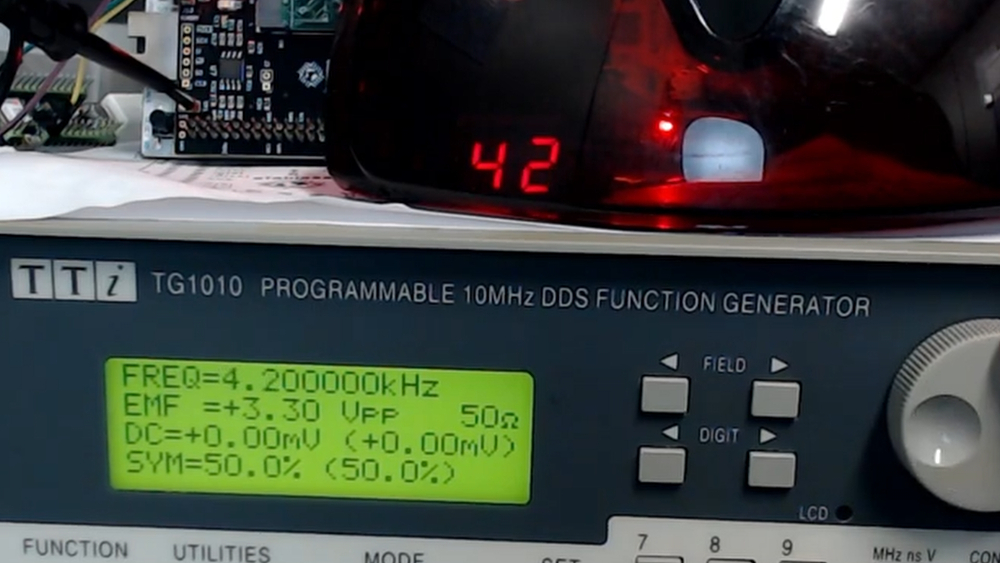

<!---

This file is used to generate your project datasheet. Please fill in the information below and delete any unused
sections.

You can also include images in this folder and reference them in the markdown. Each image must be less than
512 kb in size, and the combined size of all images must be less than 1 MB.
-->

## How it works

Debounces the input signal and counts how many transistions occur in a given period. A state machine
then divides the count by ten by repeatedly subtracting ten and then displays the tens and units on the seven segment display.

## How to test

Apply a signal to the signal input and the frequency will be measured and displayed on the seven segment. The dot is used to select between display tens and units.

To change the count period (to get accurate counts), set it to match the clock frequency: clock_mhz * 100 - 1. So for a 10MHz clock, set to 999.
Set the desired period (top 4 bits ui_in and all of uio_in) on the bidirectional inputs and toggle load input.

To debug, enable debug mode and check the bidirectional outputs for state machine, clock count and edge count information.

## External hardware

A dual seven segment PMOD and a frequency source.
